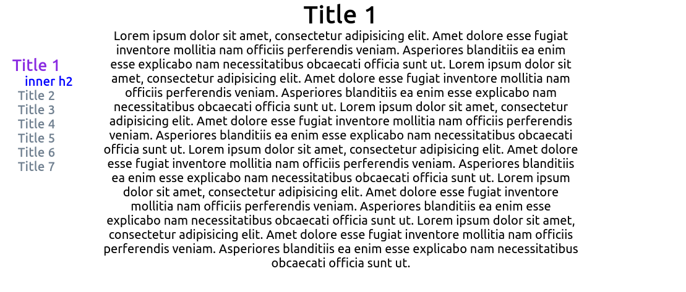

# Toc with React

Simple implement of [TocBot](https://tscanlin.github.io/tocbot/ "Generate a table of contents based on the heading structure of an html document").


## Quick config of tocbot:
```js
import * as tocbot from 'tocbot';

useEffect(() => {
    tocbot.init({
        // Where to render the table of contents.
        tocSelector: '.js-toc',
        // Where to grab the headings to build the table of contents.
        contentSelector: 'main',
        // Which headings to grab inside of the contentSelector element.
        headingSelector: 'h1, h2, h3',
        // For headings inside relative or absolute positioned containers within content.
        hasInnerContainers: true,
        // Main class to add to lists.
        linkClass: 'toc-link',
        // Class that gets added when a list should be collapsed.
        isCollapsedClass: 'is-collapsed',
        // Smooth scrolling enabled.
        scrollSmooth: true,
        // Smooth scroll duration.
        scrollSmoothDuration: 420,
        headingsOffset: 40,
        collapseDepth: 0,
    });
}, [])
```
